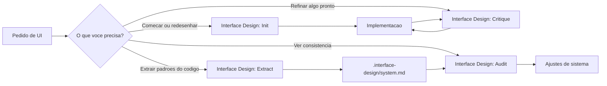

# Documentação dos Prompts do Copilot

Este projeto usa uma skill global de interface design no GitHub Copilot e quatro prompts de usuário para acelerar tarefas de UI no VS Code.

## Visão Geral

Existem dois níveis nessa configuração:

- Skill: base de conhecimento reutilizável para decisões de interface, consistência visual, crítica e validação.
- Prompts: atalhos de chat que chamam o Copilot com um objetivo bem definido.

Na prática:

- a skill `interface-design` define como pensar o trabalho
- os prompts definem quando e para que usar esse raciocínio

## O Que Foi Instalado

### Skill global

- Nome: `interface-design`
- Função: orientar design de interfaces de apps, dashboards, catálogos, telas administrativas e fluxos de produto

### Prompts de usuário

- `Interface Design: Init`
- `Interface Design: Critique`
- `Interface Design: Audit`
- `Interface Design: Extract`

Esses prompts aparecem no chat do Copilot quando você digita `/`.

## Como Usar no VS Code

1. Abra o chat do Copilot.
2. Digite `/`.
3. Escolha um dos prompts da lista.
4. Complete com o objetivo da tarefa.

Exemplos:

- `/Interface Design: Init melhorar a home pública do catálogo`
- `/Interface Design: Critique revisar a tela de detalhe do produto`
- `/Interface Design: Audit auditar os componentes da vitrine`
- `/Interface Design: Extract extrair sistema visual da interface pública`

## Fluxo Visual de Uso

Leitura rapida do fluxo:

- `Init` inicia ou reposiciona uma interface.
- `Critique` lapida o que foi feito.
- `Extract` transforma padroes existentes em sistema.
- `Audit` verifica se a interface continua coerente com esse sistema.

## Organizacao dos Arquivos

Esta configuracao ficou separada em tres camadas para nao misturar tudo dentro do projeto.

### 1. Skill global do Copilot

Fica no perfil do usuario e pode ser reutilizada em outros projetos.

- Caminho: `C:\Users\Helpdesk\.copilot\skills\interface-design\SKILL.md`
- Funcao: guardar a base de raciocinio sobre design de interface

### 2. Prompts globais do VS Code

Tambem ficam no perfil do usuario e aparecem no chat quando voce digita `/`.

- Caminho: `C:\Users\Helpdesk\AppData\Roaming\Code\User\prompts\`
- Arquivos:
	- `interface-design-init.prompt.md`
	- `interface-design-critique.prompt.md`
	- `interface-design-audit.prompt.md`
	- `interface-design-extract.prompt.md`

### 3. Sistema visual do workspace

Fica dentro deste projeto e serve para manter o Copilot consistente com a identidade do catalogo.

- Caminho: `.interface-design/system.md`
- Funcao: registrar paleta, profundidade, superficies, espacamentos e padroes reutilizaveis da interface publica

## Relacao Entre Skill, Prompts e System File

- A skill ensina o Copilot a pensar.
- Os prompts dizem qual tipo de tarefa executar.
- O `system.md` diz como este projeto deve parecer.

Resumo pratico:

- skill = conhecimento geral
- prompt = comando de trabalho
- system file = memoria visual do projeto

## O Que Cada Prompt Faz

### Interface Design: Init

Use quando:

- for iniciar uma tela nova
- for redesenhar uma área importante
- quiser começar um trabalho de UI com direção clara

O que ele faz:

1. Define a intenção da tela.
2. Identifica quem é a pessoa usuária, o que ela precisa fazer e como a interface deve parecer.
3. Procura um sistema visual existente no projeto.
4. Se não houver sistema, propõe uma direção visual concreta.
5. Implementa a UI com base nessa direção.
6. Faz uma breve autocrítica antes de apresentar o resultado.

Resultado esperado:

- menos decisões genéricas
- layout com mais identidade
- coerência entre intenção visual e código

### Interface Design: Critique

Use quando:

- a interface já existe, mas está sem personalidade
- alguma tela parece correta, porém sem acabamento
- você quer uma revisão mais exigente de craft

O que ele faz:

1. Analisa composição, hierarquia, conteúdo e estrutura.
2. Identifica decisões fracas ou genéricas.
3. Encontra o trecho mais problemático.
4. Reconstrói esse trecho com mais intenção e consistência.

Resultado esperado:

- melhoria de acabamento
- melhor hierarquia visual
- menos aparência de layout padrão

### Interface Design: Audit

Use quando:

- quiser auditar uma tela, componente ou pasta
- quiser verificar se o projeto está consistente
- quiser descobrir onde o sistema visual está se perdendo

O que ele faz:

1. Procura por um `.interface-design/system.md` no workspace.
2. Se existir, compara a interface com esse sistema.
3. Se não existir, identifica padrões repetidos e pontos de desvio.
4. Relata inconsistências em espaçamento, profundidade, paleta e padrões de componentes.

Resultado esperado:

- visão clara do que está coerente
- lista de desvios de design
- base para padronização futura

### Interface Design: Extract

Use quando:

- o projeto já tem UI pronta
- você quer transformar decisões visuais em sistema
- deseja documentar tokens e padrões reaproveitáveis

O que ele faz:

1. Analisa arquivos de interface já existentes.
2. Extrai escala de espaçamento, raios, padrões de cards, botões e filtros.
3. Identifica paleta e estratégia de superfícies.
4. Propõe uma estrutura inicial para `.interface-design/system.md`.

Resultado esperado:

- uma base para design system leve
- padronização do que já existe
- menos retrabalho entre telas futuras

## O Papel da Skill `interface-design`

Essa skill é a camada de raciocínio usada pelos prompts. Ela ajuda o Copilot a:

- começar pela intenção antes do código
- evitar soluções genéricas
- propor uma direção visual clara
- aplicar princípios de superfície, profundidade, cor, tipografia e espaçamento
- revisar a qualidade final com um olhar crítico
- transformar padrões repetidos em sistema reutilizável

## Fluxo Recomendado

Para criar algo novo:

1. Use `Interface Design: Init`.
2. Depois use `Interface Design: Critique` para lapidar.

Para organizar o que já existe:

1. Use `Interface Design: Extract`.
2. Depois use `Interface Design: Audit` para encontrar desvios.

## Aplicação no Projeto Catálogo

No contexto deste projeto, esses prompts são úteis para:

- melhorar a vitrine pública
- refinar cards de produtos
- revisar a página de detalhe
- manter consistência entre hero, filtros, seções e CTAs
- documentar padrões visuais do catálogo em um sistema próprio

## Próximo Passo Opcional

Se o projeto passar a usar esses prompts com frequência, vale criar também um arquivo `.interface-design/system.md` no workspace com:

- paleta oficial
- estratégia de superfícies
- escala de espaçamento
- padrões de botões
- padrões de cards
- regras para filtros, banners e CTAs

Isso deixa o Copilot mais consistente nas próximas sessões.